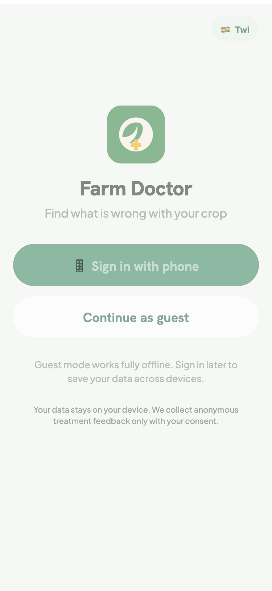
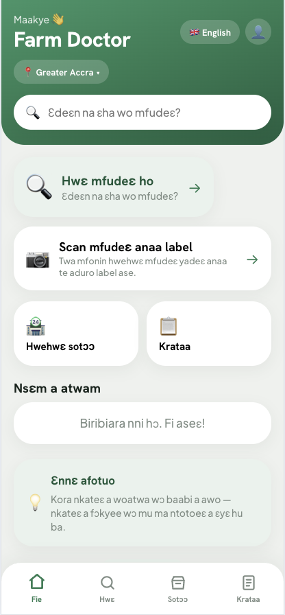
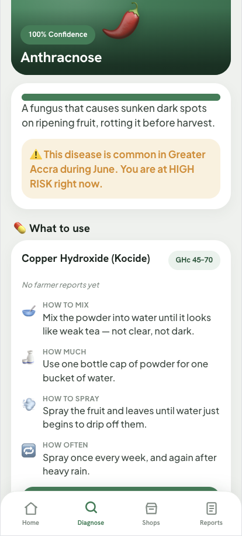
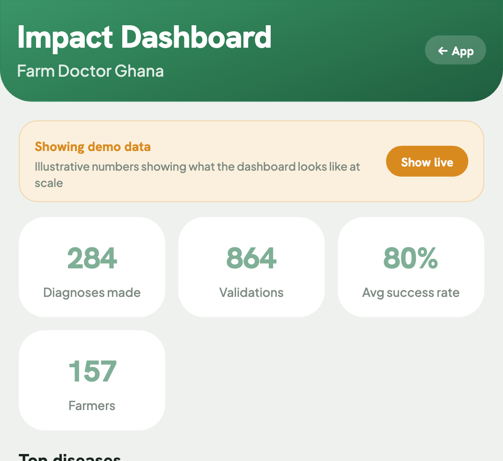

# Farm Doctor Ghana

**Offline-first crop disease diagnosis for Ghanaian smallholder farmers.**

Farmers answer a visual symptom checklist or snap a photo. The app returns a diagnosis in **Twi and English**, recommends **Ghana-specific treatments** in farmer language (bottle caps, weak-tea colour — not ml ratios), links to **local agro-input suppliers** via WhatsApp, and tracks **whether the treatment actually worked**. Built to run on 5–10 year old Android phones with poor cameras and intermittent connectivity.

**Repository:** [github.com/KennyWestKhan/farm-doctor](https://github.com/KennyWestKhan/farm-doctor)

> Built for the [Ghana AI Innovation Challenge 2026](https://ghanaaisummit.com/research) — Agriculture track.
>
> Submission deliverables: [Technical Abstract](docs/TECHNICAL_ABSTRACT.md) · [Data Sources & Ethics](docs/DATA_SOURCES.md)

<p align="center">
  
  
  
  
</p>

---

## The problem

Ghana loses an estimated 30–40% of crop yield to pests and diseases annually. Smallholder farmers — who produce over 80% of the country's food — often cannot identify what's affecting their crops until it's too late. Extension officers are spread thin (one per ~1,900 farmers), and when farmers do reach a supplier, agrochemical labels are in English with metric units that don't translate to their tools or local languages.

Farm Doctor puts diagnosis, treatment guidance, and supplier access in the farmer's pocket — working offline, in Twi, and using measurements they already understand.

## How it works

### Two-tier hybrid diagnosis

1. **Offline first** — The farmer answers a visual symptom checklist. An on-device weighted matcher scores responses against a local disease database and returns a diagnosis with a confidence score. No internet needed.
2. **Online enhancement** — If offline confidence is below 70%, the photo is queued in IndexedDB and sent to Claude Vision (via the backend) when connectivity returns. The Vision system prompt is tuned for blurry, low-quality field photos from budget Android phones.
3. **Direct scan** — `/scan/crop` skips the checklist and sends the photo straight to Claude Vision, which identifies both the crop and the disease. The farmer can correct the detected crop via an editable dropdown.

### Agrochemical label translation (novel)

Most agro-apps stop at diagnosis. Farm Doctor goes further: farmers photograph the label on any agrochemical bottle, and the app translates it into language and measurements they actually use. No other tool in the Ghanaian agricultural technology space does this.

AWS Textract extracts the text, then Claude (via function calling) translates it into:

- Plain-language instructions in English and Twi
- Everyday Ghanaian measurement analogies (bottle caps, milk tins, matchboxes, pure-water sachets, tea colour), each dose carrying the real measure in brackets — e.g. "two bottle caps (10 ml)" — so it stays verifiable against the label
- Context-aware dosing based on farm size, crop, and growth stage

### Counterfeit / banned pesticide check

Unregistered and banned pesticides are common in West African markets, and many farmers can't read the label well enough to tell. After translating a label, Farm Doctor cross-references the extracted product name and active ingredient against a curated reference list — Stockholm Convention POPs (DDT, Endosulfan, Lindane, etc.) and known EPA-Ghana restricted actives (Paraquat, Carbofuran, Monocrotophos) — and flags a clear 🚫 warning, a ✅ for commonly-registered actives, or a ❓ "ask your agro-dealer" when it can't tell. Fully offline, no extra API call. **Not** an official EPA-Ghana registry lookup (no public API exists for that) — the UI says so explicitly.

### Treatment validation loop

After applying a treatment, farmers report whether it worked. These validation reports sync to a Supabase database and feed into regional treatment success rates — creating a farmer-generated evidence base over time.

### Regional pest & disease alerts

The disease database already carries `seasonal_months`, `peak_month`, and `regional_prevalence` per disease. The Home screen filters this against the farmer's saved region and the current month to surface what's actively a risk right now — e.g. "Anthracnose peaks in Ashanti this month." Fully offline, zero extra data or API calls.

### Best-time-to-spray advisory

After a diagnosis, a "Best time to spray" card calls [Open-Meteo](https://open-meteo.com) — a free forecast API that needs no API key or account — for the farmer's region, and warns if rain is expected soon (spray will wash off) or it's currently too hot (spray can scorch leaves). If the device is offline or the request fails, it falls back to static general guidance (spray in the cool morning or evening, never just before rain).

### Post-harvest storage tips

Ghana loses 30–50% of harvested crops to poor drying and storage. After a confident diagnosis, a collapsible "Protect your harvest" card shows crop-specific drying, storage, spoilage-sign, and shelf-life guidance — bilingual, offline, sourced from CSIR/CRI post-harvest guidelines and PICS bag research.

### Farm-size dose scaling

Treatment recipes are written as concentrations ("one bottle cap per bucket of water"), which tells a farmer how to mix one batch but not how much to prepare or buy. On the diagnosis screen the farmer taps their farm size (acre-range presets, drawn as a count of field icons — no reading required); the app suggests how many sprayer loads that means for the diagnosed crop (stated assumption: a ~15 L knapsack load, crop-specific coverage rates) and computes the totals — "mix this recipe 8 times" and "buy about 8 bottle caps of powder in total (about 40 g)." Experienced farmers can override the suggestion with a −/+ stepper; the confirmed size persists to the profile and comes pre-filled on the next diagnosis. The purchase total only appears when the recipe's dose parses unambiguously — the app never shows a guessed quantity.

## Features

| Feature                                            | Route             | Needs internet?                          |
| -------------------------------------------------- | ----------------- | ----------------------------------------- |
| Symptom checklist diagnosis                        | `/diagnose`       | No                                        |
| Camera crop scan (Claude Vision)                   | `/scan/crop`      | Yes                                       |
| Agrochemical label translation (Textract + Claude) | `/scan/label`     | Yes                                       |
| Regional pest & disease alerts                     | Home              | No                                        |
| Best-time-to-spray weather advisory                | Result screen     | No (falls back to static advice offline) |
| Post-harvest storage tips                          | Diagnosis detail  | No                                        |
| Farm-size dose scaling (suggested loads + total to buy) | Diagnosis detail  | No                                   |
| Supplier map + WhatsApp/call links                 | `/shops`          | No (tiles cache after first load)        |
| Diagnosis history                                  | `/reports`        | No                                        |
| Treatment feedback ("did it work?")                | Result screen     | Syncs when online                        |
| App review / rating                                | After first scan  | Syncs when online                        |
| Phone OTP sign-in (Ghana +233)                     | Welcome           | OTP needs Supabase                       |
| Guest mode (full offline, no account)              | Welcome           | No                                        |
| Bilingual UI (Twi / English)                       | All screens       | No                                        |
| Profile (region, crops, favourite shops)           | `/profile`        | No                                        |
| Impact dashboard                                   | `/dashboard`      | No (live data + demo toggle)             |

## Auth and onboarding

On first launch the Welcome screen offers:

- **Phone OTP** via Supabase Auth (Ghana +233 numbers with validation). Guest data (reports, validations, favourites) migrates to the account on sign-in.
- **Continue as guest** — full offline use, no phone required.

## Technology stack

```
Frontend    React 19 + Vite 8 PWA
            IndexedDB (idb) for offline persistence
            React Leaflet for supplier maps
            Workbox service worker (precache + runtime tile cache)
            Supabase JS SDK for auth + sync
            Bilingual context (Twi / English, auto-detect)

Backend     Node 22 + Express 5
            Anthropic SDK (Claude Vision + function calling)
            AWS Textract SDK (label OCR)
            Supabase (PostgreSQL) for farmer reports + validations

Hosting     Frontend → Vercel
            Backend → Render
            Database → Supabase
```

## Repo layout

```
frontend/
├── src/
│   ├── screens/        14 screen components
│   ├── components/     14 reusable UI components
│   ├── data/           Disease DB, suppliers, tips, success rates
│   ├── db/             IndexedDB storage, sync engine, Supabase client
│   ├── engine/         Offline symptom matcher (rule-based scoring)
│   ├── auth/           AuthContext, OTP, guest migration
│   ├── utils/          Input sanitization, search, preferences
│   ├── styles/         Theme CSS (Rich Ghanaian Earth design system)
│   └── i18n.jsx        Twi/English bilingual context
└── vite.config.js      PWA + Workbox config

backend/
├── src/
│   ├── server.js       Express API (Vision proxy, label translation, validations, reviews)
│   ├── prompt.js       Claude Vision system prompt (tuned for field photos)
│   ├── labelTranslate.js  Textract OCR → Claude function calling pipeline
│   └── sanitize.js     Input sanitization (mirrors frontend)
└── schema.sql          Supabase PostgreSQL schema

render.yaml             Backend deploy blueprint
```

## Run locally

```bash
# Install everything
npm run install:all

# Frontend (works fully offline with no backend)
npm run dev:web          # http://localhost:5173

# Backend (optional — needed for Vision, label OCR, Supabase sync)
npm run dev:api          # http://localhost:3001
```

The frontend runs without the backend in demo/offline mode. Point it at the API with `VITE_API_URL` in `frontend/.env`.

## Configuration

### Backend (`backend/.env`)

| Variable                                                   | Purpose                                                        |
| ---------------------------------------------------------- | -------------------------------------------------------------- |
| `ANTHROPIC_API_KEY`                                        | Claude Vision + label translation                              |
| `VISION_MODEL`                                             | Default `claude-haiku-4-5-20251001`                            |
| `SUPABASE_URL`, `SUPABASE_SERVICE_ROLE_KEY`                | Data storage. Run `backend/schema.sql` in Supabase SQL editor. |
| `AWS_REGION`, `AWS_ACCESS_KEY_ID`, `AWS_SECRET_ACCESS_KEY` | Textract for label OCR                                         |
| `SCAN_LIMIT`                                               | Daily AI scan cap per user/IP (0 = unlimited)                  |
| `ALLOWED_ORIGINS`                                          | Comma-separated CORS allowlist                                 |

### Frontend (`frontend/.env`)

| Variable                 | Purpose                                 |
| ------------------------ | --------------------------------------- |
| `VITE_API_URL`           | Backend base URL. Blank = offline-only. |
| `VITE_SUPABASE_URL`      | Supabase project URL (phone OTP auth)   |
| `VITE_SUPABASE_ANON_KEY` | Supabase anon key (safe for client)     |

## Content coverage (MVP)

- **Crops (6):** chilli pepper, cassava, sweet potato, groundnut, ginger, cocoa
- **Diseases (23):** with symptoms, regional prevalence, seasonality, treatments
- **Regions (16):** all of Ghana's regions selectable app-wide (location, shops, reports, dashboard). Disease prevalence/seasonality data and the spray-timing advisory currently cover the original 5 MVP regions (Ashanti, Greater Accra, Western, Volta, Northern) in full; the other 11 work for diagnosis, shops and reports but don't yet show a regional risk note or home alert.
- **Suppliers (13 seeded)** across the 5 MVP regions with WhatsApp deep links
- **Storage guidance** for all 4 original crops (drying, storage method, spoilage signs, shelf life)

## Data sources

| Data                                                                       | Source                                                                                                                                                    | Format                                               |
| -------------------------------------------------------------------------- | --------------------------------------------------------------------------------------------------------------------------------------------------------- | ---------------------------------------------------- |
| Disease knowledge (symptoms, treatments, regional prevalence, seasonality) | Expert-curated from CSIR/SARI extension guidance, MOFA Directorate of Crop Services materials, IITA cassava disease resources, CRI root crop publications | In-app JSON (`frontend/src/data/diseaseDatabase.js`) |
| Farmer treatment validations                                               | Self-collected via in-app "Did it work?" feedback form                                                                                                    | IndexedDB → Supabase `validations` table             |
| App reviews                                                                | Self-collected star ratings + comments                                                                                                                    | Supabase `reviews` table                             |
| Supplier locations                                                         | Seeded demo data (placeholder)                                                                                                                            | In-app JSON (`frontend/src/data/suppliers.js`)       |
| Treatment success rates                                                    | Live from Supabase `treatment_success_rates` view; seeded fallback for dashboard demo mode                                                                | Supabase view + cached in IndexedDB                  |
| Map tiles                                                                  | OpenStreetMap (© contributors)                                                                                                                            | Runtime cache via service worker                     |
| Spray-timing forecast                                                      | [Open-Meteo](https://open-meteo.com) (free, no API key)                                                                                                    | Live fetch per region, no caching                    |
| Ginger & cocoa disease knowledge                                           | COCOBOD/CRIG management guides, CSIR-CRI root & tuber disease reports, MOFA crop health guidelines                                                         | In-app JSON (`frontend/src/data/diseaseDatabase.js`) |

## Security

- **API keys never in the PWA** — Claude and AWS credentials live server-side only; the frontend communicates through proxy endpoints.
- **Input sanitization on both client and server** — strips control characters, zero-width chars, bidi overrides; normalizes Unicode; enforces length caps.
- **Prompt injection defense** — structural separation (user text is always a separate `user` role message, never concatenated into system prompts) plus sanitization as a second layer.
- **CORS lockdown** — allowlist-based, defaults to localhost + `*.vercel.app`.
- **Scan rate limiting** — configurable daily cap per user/IP to protect API credits.

## API endpoints

| Method | Path                   | Purpose                                 |
| ------ | ---------------------- | --------------------------------------- |
| GET    | `/api/health`          | Health check (reports capability flags) |
| POST   | `/api/diagnose`        | Claude Vision crop diagnosis            |
| POST   | `/api/translate-label` | Textract OCR + Claude label translation |
| POST   | `/api/validations`     | Store farmer treatment feedback         |
| POST   | `/api/reviews`         | Store app star ratings                  |

## Cost analysis

| Component                    | Service       | Cost at MVP          | Cost at 10k farmers/month |
| ---------------------------- | ------------- | -------------------- | ------------------------- |
| AI diagnosis (Claude Vision) | Anthropic API | ~$0.003/scan (Haiku) | ~$30/month                |
| Label OCR                    | AWS Textract  | ~$0.0015/page        | ~$5/month                 |
| Database + Auth              | Supabase      | Free tier (500MB)    | $25/month (Pro)           |
| Frontend hosting             | Vercel        | Free tier            | Free tier                 |
| Backend hosting              | Render        | Free tier            | $7/month                  |
| **Total**                    |               | **~$0/month** (dev)  | **~$67/month**            |

The offline-first architecture keeps costs low: most diagnoses happen on-device with zero API calls. Claude Vision fires only when offline confidence is below 70% or the farmer uses the direct scan feature.

## Evaluation plan

**Offline matcher accuracy:**

- Ground truth: MOFA/CSIR field-confirmed disease cases from extension reports
- Metric: top-1 and top-3 accuracy against confirmed diagnoses
- Target: ≥75% top-1 accuracy on the 15 covered diseases
- Method: Compile 50+ confirmed cases per crop, run through `diagnoseOffline()`, compare

**Claude Vision accuracy:**

- Ground truth: same field-confirmed cases, using actual farmer-quality photos
- Metric: agreement rate with expert diagnosis
- Target: ≥85% agreement on clear presentations

**Treatment validation loop:**

- Track `worked` / `partial` / `failed` outcomes by treatment × region over time
- Success criterion: ≥70% positive outcome rate per recommended treatment
- This is the core feedback signal that improves recommendations over time

**User adoption (post-launch):**

- Repeat usage rate (>1 scan per farmer)
- Treatment feedback submission rate
- Time-to-diagnosis (target: <2 minutes)

## Expansion roadmap

| Phase             | Scope                                                                                                | Timeline               |
| ----------------- | ---------------------------------------------------------------------------------------------------- | ---------------------- |
| **MVP** (current) | 6 crops (incl. ginger, cocoa), 23 diseases, all 16 regions selectable (5 with full disease/risk data), Twi + English, regional alerts, spray timing, storage tips | Competition submission |
| **Phase 2**       | Add maize, rice, plantain, tomato (Ghana's top staples)                                              | Q3 2026                |
| **Phase 3**       | Ewe, Dagbani, Ga language support; MOFA extension officer dashboard                                  | Q4 2026                |
| **Phase 4**       | Real supplier directory (verified agro-dealers); SMS fallback for non-smartphone users               | Q1 2027                |
| **Phase 5**       | Counterfeit/banned pesticide checker; crowdsourced market price reference; integration with Complete Farmer platform; field-collected accuracy benchmarks | Q2 2027                |

## Known limitations

- Twi translations have been reviewed by a native Twi speaker (July 2026). Strings added after that review are flagged in `TWI_REVIEW_QUEUE` in `diseaseDatabase.js` until they're signed off too.
- Supplier data is placeholder (seeded with demo WhatsApp numbers).
- Dashboard defaults to live data (which may be zero initially). A demo toggle lets judges preview the dashboard at scale. Treatment success rates on diagnosis cards pull from the live `treatment_success_rates` Supabase view.
- Offline matcher is rule-based (not ML) — a deliberate choice for reliability on low-end devices with no connectivity. Accuracy benchmarking against field-collected cases is in progress.
- Currently covers 6 crops / 23 diseases. Expansion to additional Ghanaian staples (maize, rice, plantain, tomato) is planned.
- Spray-timing advisory uses a single representative coordinate per region (not farm-precise GPS) and a simplified rain/heat heuristic — good enough for go/no-go guidance, not a precision ag tool.
- All 16 Ghana regions are selectable, but disease prevalence/seasonality data (and therefore regional risk notes + home alerts) only exists for the 5 original MVP regions. The other 11 still get full diagnosis, supplier, and report functionality.

## License

MIT
